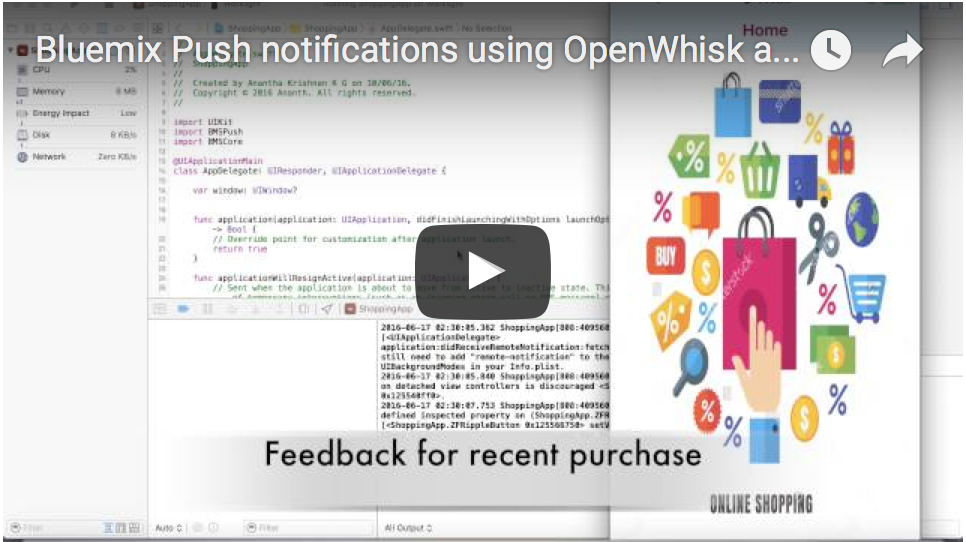

Retail-Customer-Feedback-Scenario
===========================================

The Retail-Customer-Feedback-Scenario push sample is an intuitive example usage of [Bluemix Push Notifications Service](https://console.ng.bluemix.net/docs/services/mobilepush/index.html?pos=2) with the help of [Watson Tone Analyzer Service](http://www.ibm.com/smarterplanet/us/en/ibmwatson/developercloud/tone-analyzer.html) , [OpenWhisk](https://developer.ibm.com/open/openwhisk/) and [Cloudant Service](https://cloudant.com/). 


   

   [](https://youtu.be/9Qx91S2ZO6I)
   

## Overview
 
The Retail-Customer-Feedback-Scenario push sample implements the core features of the scenario described above. It showcases OpenWhisk, Watson APIs, and Cloudant with Bluemix Push Notifications service and demonstrates mobile integration capabilities. The Feedback app will register a feedback on the recently purchased items to the cloudant `complaints` database. The OpenWhisk will read changes in the `complaints` and will send data to Watson Tone Analyzer. The Tone Analyzer will send back the results to OpenWhisk. By analyzing the results, OpenWhisk will fetch appropriate message from Cloudant `moods` database and construct a valid message. This message gets pushed to `IBM Push Notifications service`, and is delivered to the mobile device.
 

## Requirements

### Setup Bluemix and Cloudant.

Complete the steps:

 1. Create a [Bluemix Application](http://console.ng.bluemix.net). Configure the Bluemix Push Notifications service.

 2. Create and bind a Watson Tone Analyzer Service to your application.

 3. Create a database named `mood` in your [Cloudant](https://cloudant.com/). In the `mood` database, create a view named `new_view` and design named `moodPick`.

 4. Click the new design document you have created in step 3 and update it with the following lines. Do not have to change the `_id` and `_rev` values.

	```
	 {
	  "_id": "_design/moodPick",
	  "_rev": "XXXXXXXXXXXXXXXXXXXXXXXXXXXXX",
	  "indexes": {
	    "fields": {
	      "analyzer": "keyword",
	      "index": "function(doc) {index("default", doc._id, {"facet": true});if ((doc.mood) || (doc.mood===0)){index("doc.mood", doc.mood);}if ((doc.message) || (doc.message===0)){index("message", doc.message);}}"
	    }
	  },
	  "views": {
	    "new_view": {
	      "map": "function (doc) { emit(doc.mood,doc.message);}"
	    }
	  },
	  "language": "javascript"
	}
	
    ```

 5. To the updated new design document, add messages for each emotions - `Fear, Sadness, andDisgust, Anger and Joy` (Watson Tone Analyzer outputs). For example,

	```
	{
	  "mood": "Joy",
	  "message": "thank you very much for your valuable feedback. We are extremely happy to here from you. Come back again have a wonderfull shopping experience with us."
	}
	```
 6. In your Cloudant, create one more database named `complaints`.


## Sending Push Notifications

  The `sendFeedback.js` file need the following parameters to complete the actions. 

- `appId` - Bluemix app GUID.

- `appSecret` - Bluemix Push Notification service appSecret.

- `version` - This is the version of the Tone Analyzer service .

- `message` - The test value that is passing to the Tone Analyzer service as user Input.

- `cloudantUserName` - Your Cloudant username. This is for accessing your `mood` database in Cloudant.

- `cloudantPassword` - Your Cloudant password. This is for accessing your `mood` database in Cloudant.

- `appRegion` - Region where your Bluemix app is hosted. For example,for US Dallas -`.ng.bluemix.net`.

- `deviceIds` - The deviceId to which the message need to be send. This data  is taken from the `complaints` database.
- `name` - Name of the customer. This data is taken from the `complaints` database.


### Setup the OpenWhisk.

For OpenWhisk setup, you need to get authentication from [Bluemix OpenWhisk](https://new-console.ng.bluemix.net/openwhisk/cli). Install OpenWhisk CLI and Auth.

### Example App.

  The example app have Feedback sending feature. Complete the following steps before running the example app:


1. Create an OpenWhisk `action` using the command:

	``` 
	wsk action update  yourActionName sendFeedback.js -p version 'toneAnalyserVersion' -p cloudantUserName '' -p cloudantPassword '' -p appSecret '' -p appId '' -p appRegion '.ng.bluemix.net' 
	```

2. Create a OpenWhisk `Trigger`.

	```
	wsk trigger create yourTriggerName --feed /yourNameSpace/CloudantPackage/changes -p dbname complaints -p includeDoc true -p username 'cloudantUsername' -p password 'cloudantPassword' -p host 'cloudantUsername.cloudant.com'
	```
3. Create OpenWhisk rule to join `yourActionName` and `yourTriggerName`.

	```
	wsk rule create --enable yourRule yourTriggerName yourActionName
	```
4. Enable the activation poll.

	```
	wsk activation poll
	```
5. Open the example app in `XCode.app`. Go to the `Info.plist` file and add values for `cloudantPermission` and `cloudantUserName`. 
    
    

6. Do `carthage update` in the application to add the [Bluemix Push service SDK](https://github.com/ibm-bluemix-mobile-services/bms-clientsdk-swift-push).

7. Run the application and register for Push Notifications and close the app.

8. Reopen the app again. For feedback, go to the feedback page to send feedback.

9. You will get push notifications as feedback response. 


### License

Copyright 2015-2016 IBM Corporation

Licensed under the [Apache License, Version 2.0 (the "License")](http://www.apache.org/licenses/LICENSE-2.0.html).

Unless required by applicable law or agreed to in writing, software distributed under the license is distributed on an "as is" basis, without warranties or conditions of any kind, either express or implied. See the license for the specific language governing permissions and limitations under the license.


